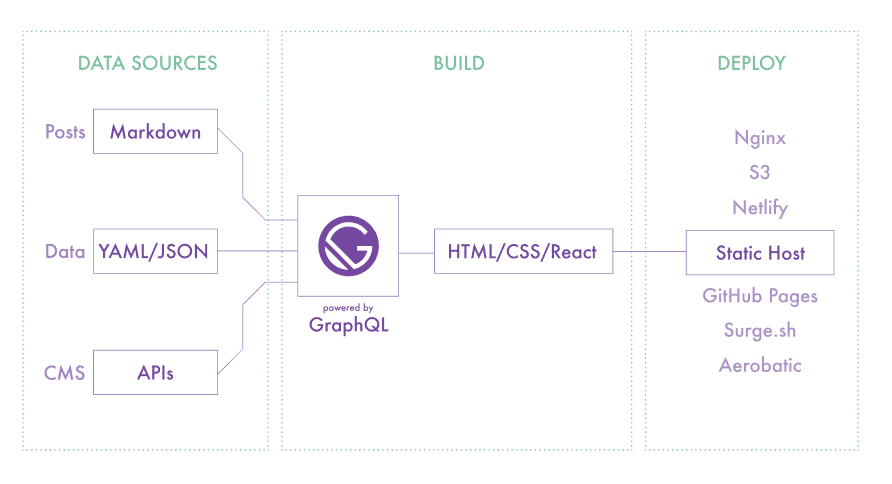

## 블로그를 만들기위해서 조사한 것

```
  1. Git
  2. Powershell
  3. Static Site Generator(정적 사이트 생성기)
  4. Jekyll / Gatsby
  5. Markdown
  6. lint
  7. React
```

### 1. 깃

- [Pro Git](https://git-scm.com/book/ko/v2) 참조

### 2. 파워쉘

- cmd보다 강력한 스크립트 지원
- 모든 명령은 Get-Help 와 같이 동사-명사 형식

### 3. Static Site Generator(정적 사이트 생성기)

- 동적 사이트  
  HTML 페이지를 클라이언트의 요청에 따라서 실시간으로 생성해서 보내준다는 의미  
   =>큰 비용  
   =>느리다

- 정적 사이트  
  그저 이미 만들어져있는 것을 보내주면 그만  
   =>빠르다  
   =>배포가 쉽다

- 실질적인 정적 웹사이트의 의미  
  단순히 HTML을 serve 해준다는 의미에서의 웹사이트를 말하는 것이 아니라 거기서 한 층 더 나아가 웹사이트를 동적으로 생성하되, 정적으로 serve한다는 의미

- 정적사이트가 무조건 좋은 것인가?  
  아니다. 블로그는 모든 시점에서 동적일 필요가 없기 때문에 정적 웹페이지로 만들지만 반면 소셜 사이트를 정적 웹페이지로 만드는 건 불가능하다. 따라서 모든 종류의 웹사이트가 정적일 수 없다. 반대로 모든 종류의 웹사이트가 동적일 필요도 없다.

### 4. Jekyll / Gatsby

Jekyll

- Ruby언어로 제작
- 아주 심플하고 블로그 지향적인 정적 사이트 생성기

Gatsby

- React 기반의 정적 페이지 생성 프레임워크
- Blazing-fast static site generator for React



### 5. Markdown

마크다운

- 글을 쓰는 사람들을 위한 글쓰기 도구
- 텍스트 기반의 마크업 언어
- 쉽게 쓰고 읽을 수 있으며 HTML로 변환이 가능

마크다운의 장점

- 간결
- 기본문법만 알고있다면 손쉽게 작성가능
- 버전관리시스템을 이용하여 변경이력관리 + 지원하는 프로그램과 플랫폼의 다양성

마크다운의 단점

- 표준이 없다
- 모든 HTML 마크업을 대신하지 못한다


### 6. lint

- 오래된 스웨터의 보푸라기 같은 것. 보푸라기가 많으면 옷이 보기좋지 않은데 코드에서도 이런 보프라기가 존재한다.
- 보푸라기 같은 자잘한 오류검사를 할 수 있는 도구를 lint라고 한다.예를들어 들여쓰기를 맞추지 않은 경우나 선언한 변수를 사용하지 않은 경우이다.
- markdownlint
  마크다운 문서 작성시 문서 포맷에 일관성을 줄 수 있게끔 화면에 이런저런 표시를 해 준다.

### 7. React

- 자바스크립트 라이브러리의 하나로서 사용자 인터페이스를 만들기 위해 사용
- Gatsby 동작 과정 안에 React가 포함되어 있다.
- Gatsby가 페이지를 만들고 내용을 구조하기 위해 사용하는 코드 라이브러리
