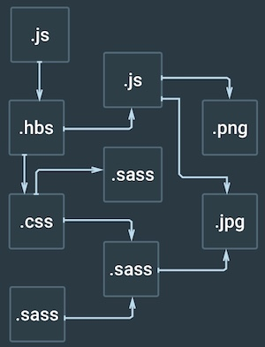

## FiveFs

- 나에게 맞는 "좋은 습관"을 내재화시키자
- 마지막 항목인 Feedback은 해당 날짜 7일 후에 다시 회고하면서 작성하고 있습니다.

## Facts

- 흑석 모각코 9시~17시30분 참가했습니다. 

- 알고리즘 2문제 풀었습니다.

- 깃 공부했습니다. 

- 개발자 김정환님의 블로그에서 '프론트엔드 개발환경의 이해'를 실습하면서 공부했습니다. 어제는 전체적으로 파악하는데 목적을 두고 공부했고 오늘은 좀 더 세부적으로 공부했습니다. 

- 리눅스 명령어 공부했습니다. 

## Feelings

- 깃을 쓸 때마다 좀 생각을 하면서 써야겠습니다. 너무 아무생각없이 사용해온 것 같습니다. 

- 알고리즘 문제풀고 다른 사람들이 푼거 봤는데 정규표현식을 이용해서 대부분 풀어서 찾아봤는데 외계어같고 복잡하네요. 알고리즘 풀 때 많이 사용하는 거 같은데 좀 더 찾아봐야겠습니다. 

- 아직까지 리눅스는 좀 불편합니다ㅜㅜ

- 오늘 모각코에서는 전부 현직 개발자분들과 했습니다. 평일에 일하고 주말까지 일정을 잡고 나와서 하는게 쉽지 않을꺼 같은데 개발 공부는 끝이 없다라는 걸 다시금 느낍니다. 

- 주말에는 오후 5시 반까지 해야할 일을 끝내고 그 이후에는 쉬려고 마음먹었는데 어느정도 끝내서 뿌듯합니다. 이번주 마무리가 좋습니다.  

## Findings

- 알고리즘
  ```
  정규표현식 /^(\d{4}|\d{6})$/ 의미 
 
  ^       a string that starts with
  (       either
    \d    a digit (0-9)
    {4}   that repeats four times
  |       or
    \d    a digit (0-9)
    {6}   that repeats six times
  )
  $       and then ends

  ```

- 웹팩은 모든 파일을 모듈로 바라봅니다.자바스크립트로 만든 모듈 뿐만아니라 스타일시트, 이미지, 폰트까지도 전부 모듈로 보기 때문에 import 구문을 사용하면 자바스크립트 코드 안으로 가져올수 있습니다. 

  

- Feature Branch Workflow의 핵심 컨셉은 기능별 브랜치를 만들어서 작업하는 것입니다. 

- git clone 명령은 3가지 명령을 동시에 처리하는 작업입니다.

  ```
  1. 해당 디렉터리를 빈 Git 저장소로 만드는 작업
  $ git init
  
  2. 현재 작업 중인 Git 저장소에 팀의 중앙 원격 저장소를 추가합니다. 이름을 origin으로 짓고 긴 서버 주소(URL) 대신 사용합니다.
  git remote add origin [중앙 remote repository URL]
  
  3. 중앙 원격 저장소(origin)의 master 브랜치 데이터를 로컬에 가져오기만 하는 작업
  $ git fetch origin master
  ```

## Future Action Plan

- 알고리즘에서 정규표현식을 이용한 문제가 나왔을 때 정규표현식을 직접 작성하면서 익숙해지는 시간을 가지겠습니다. 

- 리액트 이용해서 전에 공부했던 express todolist를 바꿔보겠습니다. 

## Feedback
