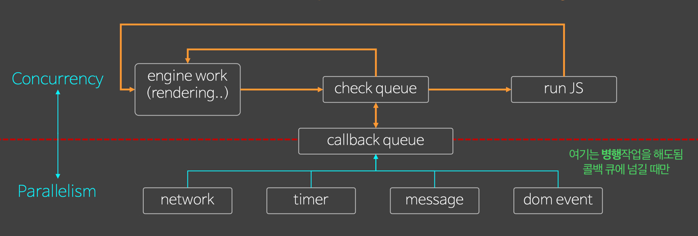

## FiveFs

- 나에게 맞는 "좋은 습관"을 내재화시키자
- 마지막 항목인 Feedback은 해당 날짜 7일 후에 다시 회고하면서 작성하고 있습니다.

## Facts

- express-todo 소스코드에 주석을 달면서 파악하려고 시도했습니다.

- 모듈에 대해서 공부했습니다.

## Feelings

- 모듈에 대해서 찾아봤는데 매우 복잡함을 느꼈습니다. 여러가지 정보들을 머릿속에 넣긴했는데 정리되지않은 느낌이 큽니다.

- express-todo 소스코드는 매우 어렵습니다. 세세하게 파고들다가 끝이없는 지옥에 빠진 기분입니다.

## Findings

- 모듈은 재사용가능한 코드조각입니다. 재사용성을 높이기 위해 사용됩니다.

- Callback Queue를 경계로 자바스크립트 엔진과 브라우저가 나뉘어 집니다.
  

## Future Action Plan

- express-todo 소스코드 구조를 파악하는데 1순위로 두고 공부해보겠습니다.

## Feedback (2020.04.09)

- 모듈은 재사용이 가능한 코드조각이라고 적었었는데, 지금 배우고 있는 리액트의 컴포넌트도 재사용 가능한 코드조각이라는 문장을 본 기억이 납니다. 관계가 있는건지 찾아봐야겠습니다.
