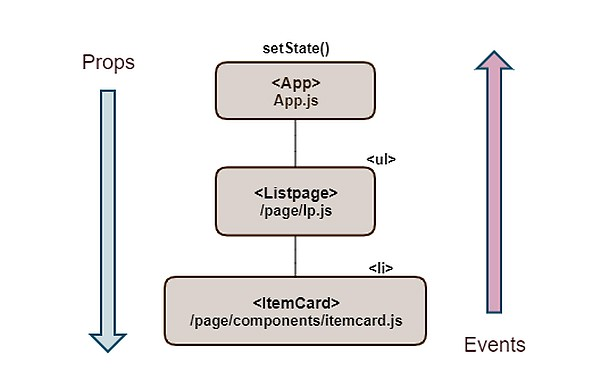

## FiveFs

- 나에게 맞는 "좋은 습관"을 내재화시키자
- 마지막 항목인 Feedback은 해당 날짜 7일 후에 다시 회고하면서 작성하고 있습니다.

## Facts

- 알고리즘 3문제 풀었습니다.

- 깃 공부했습니다. 

- React로 todolist 만들었습니다. 

## Feelings

- 알고리즘 공부시간이 너무 부족하다고 느껴집니다. 아침에 일어나서나 그리고 자기 전에 추가로 보충을 좀 해야겠습니다.

- 오늘 리액트 코드를 반복해서 많이 쳐봤습니다. 처음 리액트를 시작했던 일주일 전보다 훨씬 리액트가 친숙한 느낌입니다.   

## Findings

- 알고리즘
  ```
  - pop(); : 뒤에서부터 제거한 원소 반환

  - splice(0, 0, 0); : 배열 안에 무언가를 삽입,삭제,교체 작업
  => 1번째 매개변수: 변화를 할 원소의 1번째 index
  => 2번째 매개변수: 제거할 원소의 갯수
  => 3번째 매개변수: 기존의 원소를 삭제하고 새롭게 삽입할 값

  - concat(); : 매개변수로 전달된 문자열을 메서드를 호출한 문자열에 붙여 새로운 문자열로 반환합니다.

  ```

-  리액트 state 에서 배열을 다룰 때는 절대로 push 를 사용하면 안됩니다. push 대신 새 배열을 만드는 concat 을 사용하여 배열안에 데이터를 추가할 수 있습니다. 

- 리액트의 핵심은 “기존 뷰(View)를 날려 버리고 Virtual DOM을 사용하여 처음부터 새로 렌더링” 하는 방식으로 좀 더 빠른 속도로 뷰(View) 를 변경시켜주게 됩니다.

- 리액트에서 App.js는 state값을 관리하는 중심 컴포넌트이고, 이벤트를 받고, props를 전달합니다. 

  


- Forking Workflow

  ```
  중앙 원격 저장소를 포크(fork)해서 자신만의 원격 저장소를 만든다.
  중앙 원격 저장소를 복제한 저장소는 개인의 공개 저장소(remote repository) 역할을 한다.
  다른 개발자는 자신의 원격 저장소에 푸시할 수 없다(내려 받는 것은 가능하다).
  ```

## Future Action Plan

- 시간을 잘 활용해서 알고리즘을 2시간 공부하겠습니다.

## Feedback
